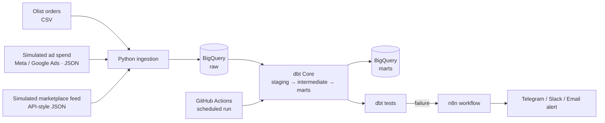

# ecommerce-data-pipeline

End-to-end ELT pipeline for a multi-channel e-commerce business: Python ingestion → BigQuery → dbt Core models and tests → automated data-quality alerts with n8n.

> **Status:** 🚧 In progress. See the [roadmap](#roadmap) for what is done and what is next.

## Business problem

A consumer brand selling across several channels tends to run on manual reports: someone exports CSVs, pastes them into spreadsheets, and nobody notices when a source silently stops loading. This project simulates that environment and replaces the manual work with:

1. Automated, repeatable ingestion from multiple sources.
2. Tested, documented models that give one trusted version of sales, customers and ad performance.
3. Automatic alerts when data quality fails, before it affects decisions.

## Architecture



## Data sources

| Source | Type | Purpose |
|---|---|---|
| [Olist Brazilian E-Commerce](https://www.kaggle.com/datasets/olistbr/brazilian-ecommerce) | Public dataset (CSV) | Orders, customers, products, payments, reviews |
| Ad spend (Meta / Google Ads) | Synthetic, generated with Python | Spend, impressions, clicks by campaign and day |
| Marketplace feed | Synthetic, API-style JSON | Second sales channel to practice multi-source integration |

## Tech stack

- **Python**: ingestion and synthetic data generation
- **Google BigQuery** (sandbox / free tier): data warehouse
- **dbt Core**: transformation, testing, documentation
- **n8n** (self-hosted with Docker): alerting and workflow automation
- **GitHub Actions**: scheduled runs and CI

## Repository structure

```
ecommerce-data-pipeline/
├── ingestion/          # Python scripts: load raw data into BigQuery
├── data_generation/    # Synthetic ad spend and marketplace data
├── dbt_project/
│   ├── models/
│   │   ├── staging/
│   │   ├── intermediate/
│   │   └── marts/
│   └── tests/
├── n8n/                # Exported workflows (.json)
├── .github/workflows/  # Scheduled dbt run and test
├── docs/               # Architecture diagram, data dictionary
└── README.md
```

## Data models (planned)

- **Staging:** one model per raw table, with renamed columns, casted types and no business logic.
- **Intermediate:** joins and calculations reused downstream (e.g. order items with payments).
- **Marts:**
  - `fct_sales`: revenue, orders and average order value by day and channel
  - `dim_customers`: customer-level metrics
  - `fct_ad_performance`: spend, clicks and cost per click by campaign

## Data quality

- dbt generic tests: `unique`, `not_null`, `accepted_values`, `relationships`
- Custom tests for business rules (e.g. no negative revenue, no orders without items)
- Freshness checks on raw tables
- Failures trigger an n8n workflow that sends an alert with the failing test and model

## Getting started

### Prerequisites

- Python 3.10+
- A Google Cloud project with BigQuery enabled (sandbox mode is enough)
- Docker (for n8n)
- A Kaggle account to download the Olist dataset

### Setup

```bash
git clone https://github.com/<your-user>/ecommerce-data-pipeline.git
cd ecommerce-data-pipeline

python -m venv .venv
source .venv/bin/activate        # Windows: .venv\Scripts\activate
pip install -r requirements.txt

cp .env.example .env             # fill in your GCP project and dataset names
```

Authenticate with Google Cloud and create the raw dataset:

```bash
gcloud auth application-default login
bq mk --dataset <your-project>:raw
```

> Never commit credentials. `.env` and service account keys are listed in `.gitignore`.

### Run

```bash
python data_generation/generate_ad_spend.py
python ingestion/load_to_bigquery.py

cd dbt_project
dbt deps
dbt run
dbt test
dbt docs generate && dbt docs serve
```

## Roadmap

- [x] Repository setup, `.gitignore`, `.env.example`, `requirements.txt`
- [x] Synthetic data generators (ad spend, marketplace feed)
- [x] Python ingestion into BigQuery `raw`
- [x] dbt staging models and tests
- [x] dbt intermediate and marts models
- [ ] n8n alert workflow (Docker)
- [ ] GitHub Actions schedule
- [ ] Architecture diagram and data dictionary in `docs/`
- [ ] Screenshots of dbt docs lineage and n8n workflow

## Design decisions and limitations

- **Fivetran is not used.** It is a paid tool, so the ingestion layer is written in Python and plays the role a managed connector would. The pattern (extract, land raw, transform in the warehouse) is the same.
- **Scheduling uses GitHub Actions instead of a heavier orchestrator**, which is enough for the size of this project.
- **Ad spend and marketplace data are synthetic.** They are generated to resemble real exports, not taken from a real business.

## Author

**Macarena Rios**: Geographic and Environmental Engineer, MSc student in Artificial Intelligence Sciences (UNA). Moving from GIS and data science toward data engineering.

[LinkedIn](https://www.linkedin.com/) · [GitHub](https://github.com/)
