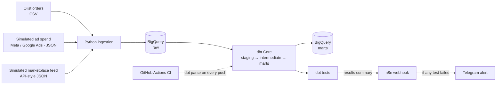
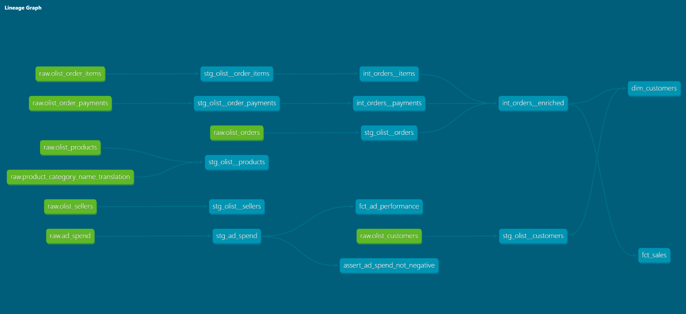

# ecommerce-data-pipeline


End-to-end ELT pipeline for a multi-channel e-commerce business: Python ingestion → BigQuery → dbt Core models and tests → automated data-quality alerts with n8n.

> **Status:** the pipeline works end to end (ingestion, modeling, testing, alerting, CI). Scheduled execution against BigQuery is not set up yet; see the [roadmap](#roadmap).

## Business problem

A consumer brand selling across several channels tends to run on manual reports: someone exports CSVs, pastes them into spreadsheets, and nobody notices when a source silently stops loading. This project simulates that environment and replaces the manual work with:

1. Automated, repeatable ingestion from multiple sources.
2. Tested, documented models that give one trusted version of sales, customers and ad performance.
3. Automatic alerts when data quality fails, before it affects decisions.

## Architecture



## Data sources

| Source | Type | Purpose |
|---|---|---|
| [Olist Brazilian E-Commerce](https://www.kaggle.com/datasets/olistbr/brazilian-ecommerce) | Public dataset (CSV) | Orders, customers, products, payments, sellers |
| Ad spend (Meta / Google Ads) | Synthetic, generated with Python | Spend, impressions, clicks by campaign and day |
| Marketplace feed | Synthetic, API-style JSON | Second sales channel to practice multi-source integration |

## Tech stack

- **Python**: ingestion and synthetic data generation
- **Google BigQuery** (sandbox / free tier): data warehouse
- **dbt Core**: transformation, testing, documentation
- **n8n** (self-hosted with Docker): alerting and workflow automation
- **Telegram**: alert channel
- **GitHub Actions**: CI that validates the dbt project on every push

## Repository structure

```
ecommerce-data-pipeline/
├── ingestion/          # Load raw data into BigQuery
├── data_generation/    # Synthetic ad spend and marketplace data
├── dbt_project/
│   ├── models/
│   │   ├── staging/
│   │   ├── intermediate/
│   │   └── marts/
│   └── tests/          # Custom (singular) tests
├── monitoring/         # Runs dbt tests and sends the summary to n8n
├── n8n/                # Docker setup and exported alert workflow
├── .github/workflows/  # CI: dbt parse and Python compile checks
├── docs/               # Data dictionary, monitoring demo, screenshots
└── README.md
```

## Data models

- **Staging:** one model per source table, with casted types and no business logic.
- **Intermediate:** order items and payments aggregated per order (`int_orders__enriched`).
- **Marts:**
  - `fct_sales`: daily orders and revenue for the Olist channel
  - `fct_sales_by_channel`: daily orders and revenue for Olist and the marketplace feed
  - `dim_customers`: one row per real customer, with order count, spend and repeat-customer flag
  - `fct_ad_performance`: daily spend, clicks, CTR and CPC by platform and campaign

Column-level details are in the [data dictionary](docs/data_dictionary.md).

### Lineage



## Data quality and monitoring

- dbt generic tests (`unique`, `not_null`, `accepted_values`, `relationships`) across all layers
- A custom test for a business rule: ad spend can never be negative
- `monitoring/run_dbt_tests.py` runs the tests and sends a summary to an n8n webhook
- n8n sends a Telegram alert only when at least one test fails, naming the failing tests and models

The demo injects duplicated, empty and negative ad spend on purpose and shows the alert. See [docs/monitoring.md](docs/monitoring.md).

## Getting started

### Prerequisites

- Python 3.10 to 3.12 (tested with 3.12; dbt does not support 3.14 yet)
- A Google Cloud project with BigQuery enabled (sandbox mode is enough)
- Docker (for n8n)
- A Kaggle account to download the Olist dataset

### Setup

```bash
git clone https://github.com/mykurena/ecommerce-data-pipeline.git
cd ecommerce-data-pipeline

python -m venv .venv
source .venv/bin/activate        # Windows: .venv\Scripts\activate
pip install -r requirements.txt
pip install dbt-bigquery

cp .env.example .env             # fill in your GCP project ID
```

Authenticate with Google Cloud and create the raw dataset:

```bash
gcloud auth application-default login
bq mk --dataset <your-project>:raw
```

Download the Olist CSV files from Kaggle into `data/olist/`.

> Never commit credentials. `.env` and service account keys are listed in `.gitignore`.

### Run

```bash
# 1. Generate synthetic data
python data_generation/generate_ad_spend.py
python data_generation/generate_marketplace_orders.py

# 2. Load everything into BigQuery (dataset: raw)
python ingestion/load_to_bigquery.py
python ingestion/load_marketplace.py

# 3. Transform and test with dbt
export GCP_PROJECT_ID=<your-project>      # PowerShell: $env:GCP_PROJECT_ID="<your-project>"
cd dbt_project
dbt run
dbt test
dbt docs generate && dbt docs serve --port 8081
```

To run the alerting demo, see [docs/monitoring.md](docs/monitoring.md).

## Roadmap

- [x] Repository setup, `.gitignore`, `.env.example`, `requirements.txt`
- [x] Synthetic data generators (ad spend, marketplace feed)
- [x] Python ingestion into BigQuery `raw`
- [x] dbt staging, intermediate and marts models
- [x] dbt tests, including a custom business-rule test
- [x] n8n alert workflow (Docker) with Telegram notifications
- [x] GitHub Actions CI: validate the dbt project on every push
- [x] Documentation: data dictionary, monitoring demo, lineage and workflow screenshots
- [ ] Scheduled `dbt build` against BigQuery (GitHub Actions with a service account)
- [ ] Source freshness checks
- [ ] Monitor the ingestion step too, not only `dbt test`

## Design decisions and limitations

- **Fivetran is not used.** It is a paid tool, so the ingestion layer is written in Python and plays the role a managed connector would. The pattern (extract, land raw, transform in the warehouse) is the same.
- **No orchestrator.** CI validates the project but nothing runs the pipeline on a schedule yet. Scheduling would need a service account stored as a GitHub secret.
- **Raw data is loaded as text.** Types are cast in the staging layer, so the raw layer stays faithful to the source.
- **Ad spend and marketplace data are synthetic.** They are generated to resemble real exports, not taken from a real business.
- **n8n runs locally.** Alerts only fire while the Docker container is running.
- **BigQuery sandbox** deletes tables after 60 days. Re-running the ingestion scripts recreates them.
- **Olist reviews and geolocation** are loaded into `raw` but not modeled.
- **`fct_sales` covers Olist only.** `fct_sales_by_channel` combines both channels.

## Author

**Macarena Rios**: Geographic and Environmental Engineer, MSc student in Artificial Intelligence Sciences (UNA). Moving from GIS and data science toward data engineering.

[LinkedIn](https://www.linkedin.com/in/macarena-rios-zaldivar-30b375201) · [GitHub](https://github.com/mykurena)
