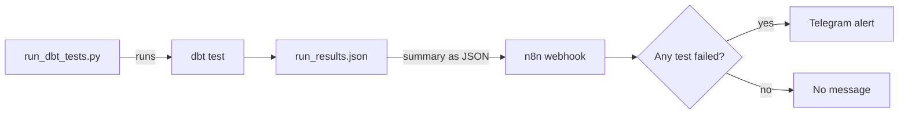
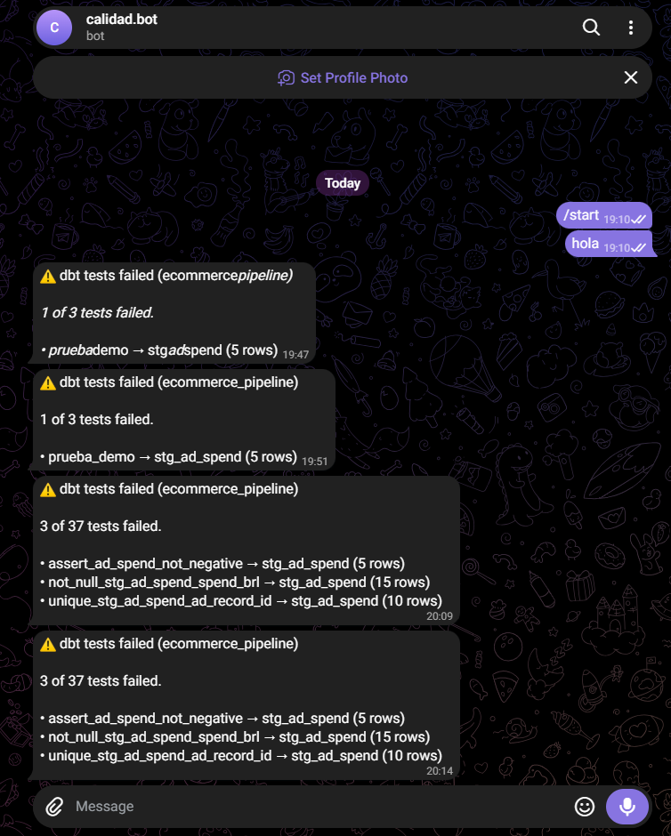
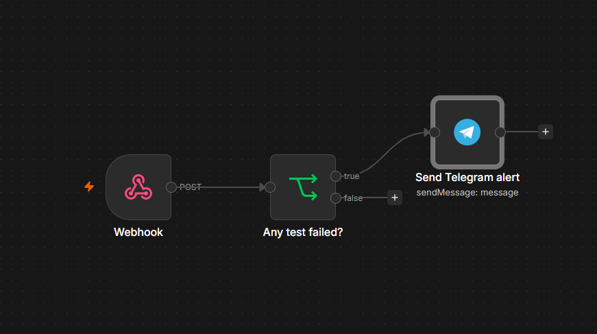
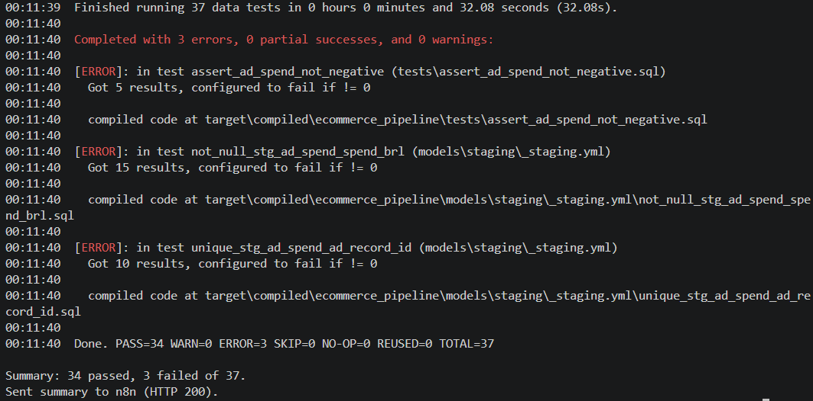

# Data quality monitoring

This pipeline does not only transform data: it also detects bad data on its own and sends an alert, so nobody has to check reports by hand.

## How it works



1. `monitoring/run_dbt_tests.py` runs `dbt test` and reads the results dbt writes to `target/run_results.json`.
2. It maps each failed test to the model it belongs to and sends a compact summary to an n8n webhook.
3. The n8n workflow (`n8n/dbt_alert_workflow.json`) checks the number of failures and, only if there is at least one, sends a Telegram message.

## Demo: injecting bad data on purpose

The ad spend generator has an `--inject-issues` flag that adds three kinds of problems to the data:

| Problem injected | dbt test that catches it | Rows flagged |
|---|---|---|
| Negative ad spend | `assert_ad_spend_not_negative` (custom test) | 5 |
| Missing ad spend | `not_null_stg_ad_spend_spend_brl` | 15 |
| Duplicated records | `unique_stg_ad_spend_ad_record_id` | 10 |

Result of the run: 34 of 37 tests passed, 3 failed, and the alert was sent.

### Telegram alert



### n8n workflow



### Terminal output



## Reproduce it

```bash
# 1. Load data with problems
python data_generation/generate_ad_spend.py --inject-issues
python ingestion/load_to_bigquery.py

# 2. Run the tests and notify n8n
python monitoring/run_dbt_tests.py

# 3. Go back to clean data (all tests pass, no alert)
python data_generation/generate_ad_spend.py
python ingestion/load_to_bigquery.py
python monitoring/run_dbt_tests.py
```

n8n runs locally with Docker:

```bash
cd n8n
docker compose up -d
```

Then open `http://localhost:5678`, import `dbt_alert_workflow.json`, add your Telegram bot credential, set your chat ID in the Telegram node and publish the workflow. Set `N8N_WEBHOOK_URL` in `.env` (see `.env.example`).

## Limitations

- n8n runs on a local machine, so alerts only fire while it is running. A production setup would host it on a server.
- Alerts only cover `dbt test`. Failures in the Python ingestion step are not monitored yet.
- The ad spend data is synthetic; the problems are injected deliberately to demonstrate detection.
